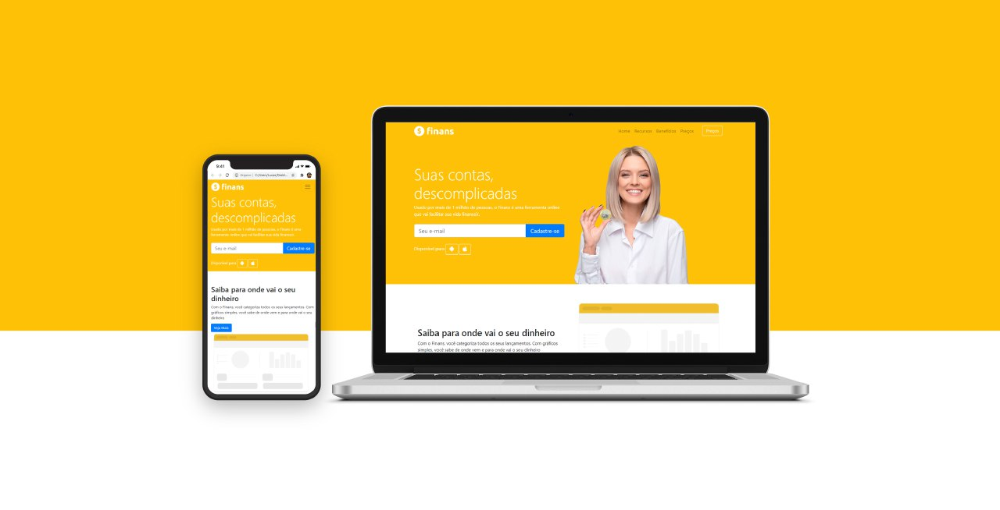

# Design de Interface Spotify Clone

### Bootstrap para recurso responsivo
### HTML5 e CSS3
 

 

#### Desenvolvido como forma de aprendizado no curso : [Desenvolvimento Web Completo 2020](https://www.udemy.com/course/web-completo/)

#### (Imagem) Design Criativo:  [@agenciamarinho](https://www.instagram.com/agenciamarinho/) 